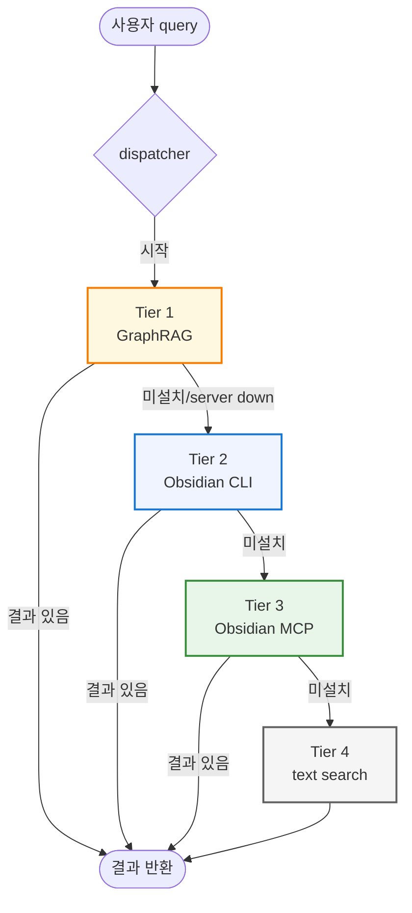
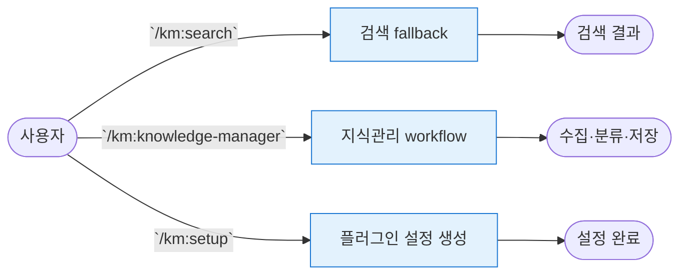
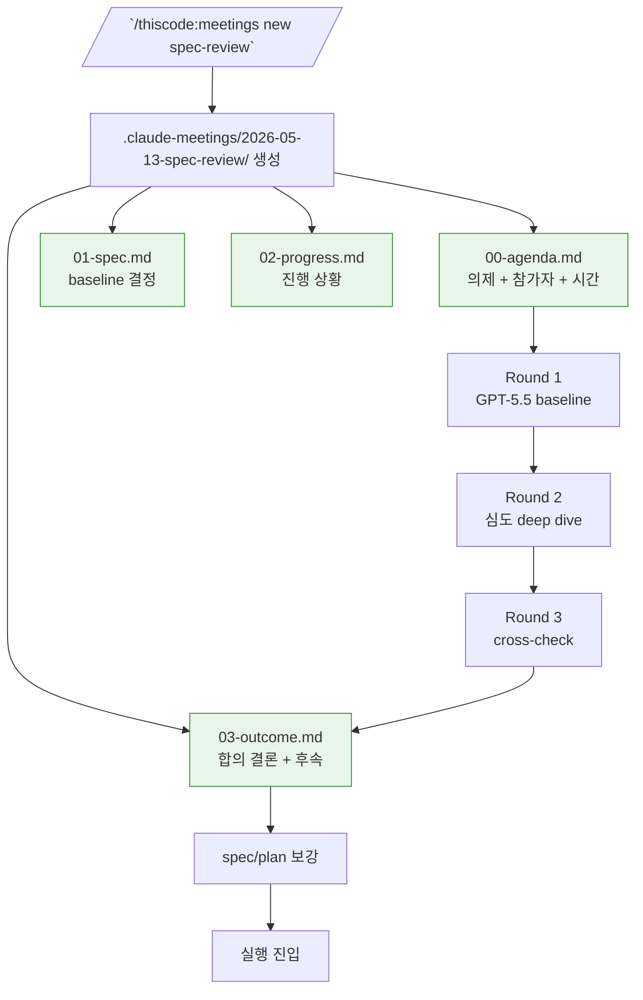
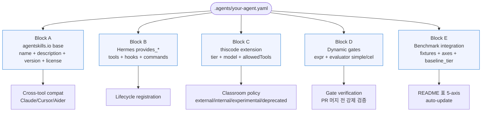
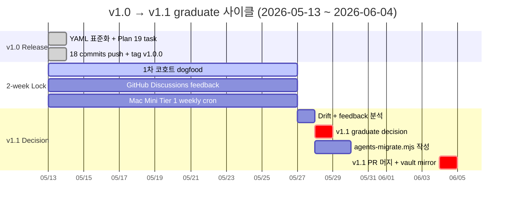
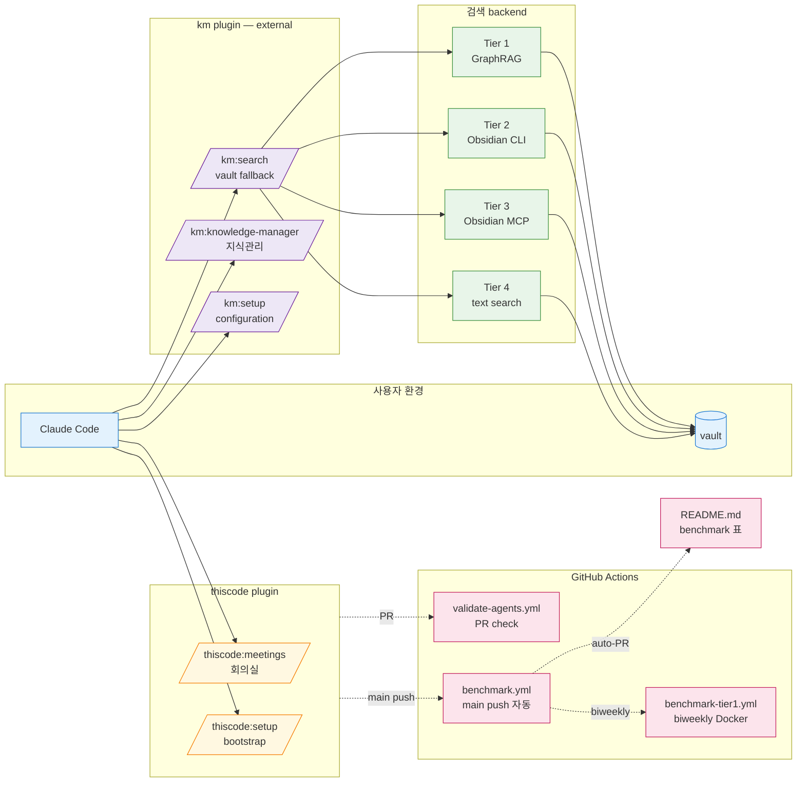

# Architecture — thiscode v1.0

thiscode 의 구조 + 흐름을 mermaid 차트로 시각화. GitHub 에서 자동 render — 별도 도구 불필요.

## 1. km plugin search fallback (external)

아래 검색 fallback은 km 플러그인이 소유하고 실행합니다. 현재 순서는
GraphRAG → Obsidian CLI → Obsidian MCP → text search입니다. ThisCode는 봇
하네스와 별도의 로컬 도구 설치기를 제공하며, 그 설치기가 제공하는
`vault-search MCP`는 이 km 검색 흐름에 포함되지 않습니다.

> 이 차트는 현재 km fallback의 순서만 보여 줍니다. latency/recall 수치는
> 현재 km runtime의 성능값으로 싣지 않으며, 역사적 로컬 도구 범위는
> [BENCHMARK.md](BENCHMARK.md)에 당시 도구 ID와 함께 남아 있습니다.

ThisCode의 별도 로컬 도구는 `scripts/install-*.sh`로 설치합니다. `/km:search`는
위의 km fallback을 실행하고 `/km:setup`은 km 저장 위치·MCP·설정을 구성하며,
검색 Tier 설치를 대신하지 않습니다.

---

## 2. km plugin commands — 외부 플러그인

---

## 3. 회의실 4-file Lifecycle

다 봇 협업 회의 시 회의록 폴더 + 4-file template 자동 셋업.

본 매뉴얼 자체가 outcome 예시: `.claude-meetings/2026-05-13-thiscode-yaml-v1.0/` → 3 라운드 GPT-5.5 토론 → 12 decisions → v1.0 spec 확정 → 19 task 실행 → release.

---

## 4. Custom Hybrid YAML — 5 Block 구조

`.agents/<name>.yaml` 한 파일이 5 block 으로 구성됨.

각 Block 책임 분리 — Block A 만 cross-tool portable, Block C/D/E 는 thiscode 전용 extension.

---

## 5. v1.0 → v1.1 Graduate Timeline

Graduate trigger 3 조건 (Round 3 outcome):
1. benchmark/results 3주 연속 metric ±20% 이상 drift
2. GitHub Discussions feedback "재현 성공률 ⚠️/❌" 3건 이상
3. `tier1-stale > 14 days` badge 14일 지속

---

## 6. 전체 통합 (요약)

---

## 관련 문서

- [README.md](../README.md) — 5-axis benchmark 표 + 빠른 시작
- [SETUP.md](SETUP.md) — 개발자용 5단계 셋업
- [SETUP-BEGINNER.md](SETUP-BEGINNER.md) — 초보자용 분기 친절 + FAQ
- [SETUP-BEGINNER.typ / .pdf](SETUP-BEGINNER.typ) — 인쇄용 typst PDF
- [MANUAL.typ / .pdf](MANUAL.typ) — 13 sections 완전 매뉴얼
- [AGENTS.md](AGENTS.md) — Custom Hybrid v1.0 spec
- [BENCHMARK.md](BENCHMARK.md) — 5-axis 측정 방법 + 해석
